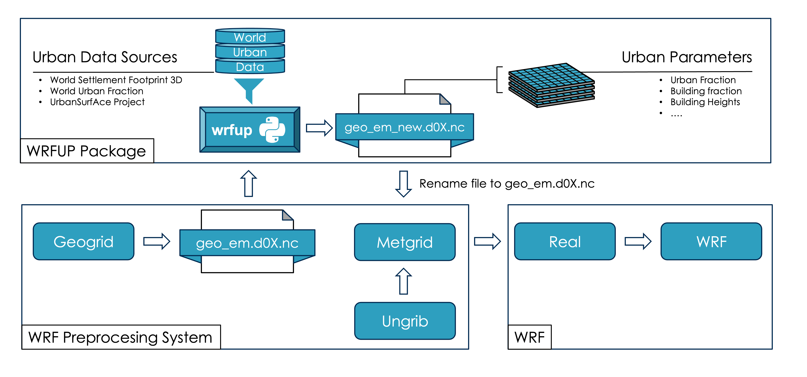

wrfup: WRF Urban Parameters Toolkit
====================================

Welcome to the **wrfup** documentation! A python tool to integrate high-resolution, real-world urban data into WRF (Weather Research and Forcast). It automatically downloads, calculates, and ingests the needed urban fields directly into WRF geo_em files. Using wrfup, users can enhance urban weather simulations with any of the WRF's urban canopy parameterizations, including SLUCM, BEP, and BEP+BEM.

Overview
--------

**wrfup** is a Python tool designed to streamline the urban data preparation of urban climate simulations. It automatically:

- **Downloads** urban morphology data like building heights and urban fraction from the state of the art global sources.
- **Calculates** the necessary urban fields for WRF, such as **URB_PARAM** and **FRC_URB2D**.
- **Ingests** these fields directly into WRF’s **geo_em** files, ensuring a fine representation of urban areas in your simulations. 

Workflow Diagram
----------------
The following diagram shows how **wrfup** integrates into the WRF preprocessing workflow:

.. toctree::
   :maxdepth: 2
   :caption: Sections:

   installation
   usage
   features
   modules

---

Indices and tables
===================

* :ref:`genindex`
* :ref:`modindex`
* :ref:`search`

