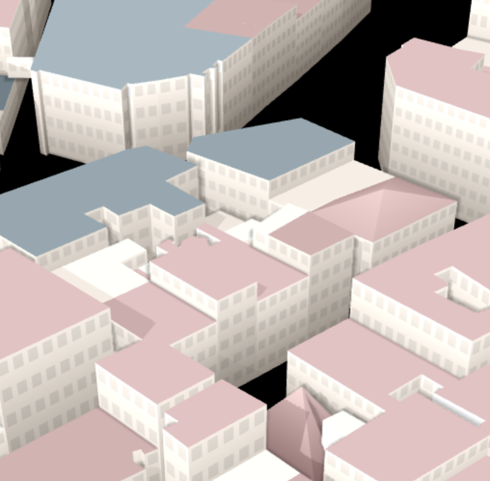

wrfup: WRF Urban Parameters Toolkit
====================================

Welcome to the **wrfup** documentation! This tool allows users to efficiently integrate real-world, high-resolution urban morphology data into WRF simulations. It provides key functionalities for downloading, calculating, and ingesting urban fields into WRF geo_em files. By using wrfup, users can enhance the accuracy of urban weather simulations with support for urban parameterizations like SLUCM, BEP, and BEP+BEM.

Contents:
---------

.. toctree::
   :maxdepth: 2
   :caption: Sections:

   installation
   usage
   features
   modules

---

Indices and tables
===================

* :ref:`genindex`
* :ref:`modindex`
* :ref:`search`

